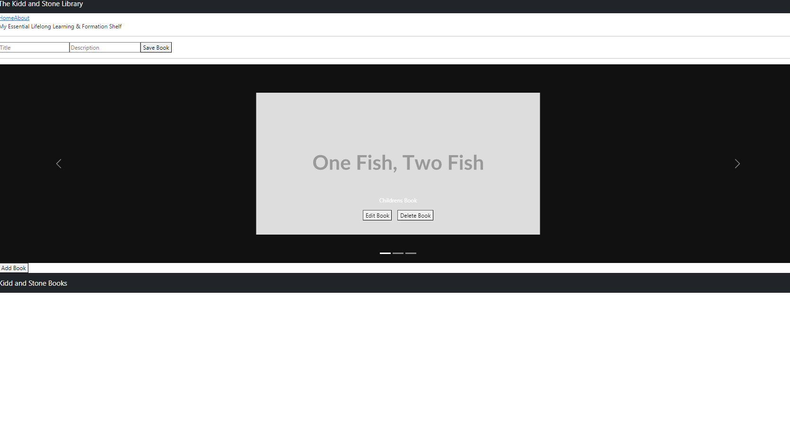

# Project Name

**Author**: Latherio Kidd, Natalie Stone
**Version**: 1.0.0 (increment the patch/fix version number if you make more commits past your first submission)

## Overview

The Can of Books App is a small web application designed to track and catalog impactful books. The app allows users to record books that have influenced them and discover recommendations for future reading. This project involves building a CRUD (Create, Read, Update, Delete) app with MongoDB as the database and connecting it to a React front-end through an Express server.

## Getting Started

To build and run this app locally, follow these steps:

1. Clone the front-end repository (can-of-books-frontend) from [GitHub](https://github.com/AgateHunter/can-of-books-frontend.git).
2. Clone the back-end repository (can-of-books-backend) from [GitHub](https://github.com/LatherioK0818/can-of-books-backend.git).
3. Add all team members as collaborators to both repositories.
4. Review and update the .gitignore files, and add blank .env files to prevent sensitive information from being pushed to GitHub.
5. Deploy both the front-end and back-end to the cloud to check for proof-of-life indicators.
6. Update the README.md files in each repository with documentation regarding the lab and the current state of development.

## Team Agreements(Draft)

**Logistical:**

1. **Availability Hours:**
   - We are generally available [insert specific hours] on weekdays. Weekends can be flexible, but I'll communicate any changes in advance.

2. **Communication Platform:**
   - We'll primarily use Slack and Remo for day-to-day communication. Important matters might be discussed through Slack, Remo, or Phone if emergencies arise.

3. **Break Schedule:**
   - We plan to take short breaks every [insert time interval, e.g., two hours]. Longer breaks will be communicated beforehand. Flexibility is key, and I'm open to adjusting based on team needs.

4. **Falling Behind Plan:**
   - If We start to fall behind, We'll immediately communicate this to the team. We can then collectively assess the situation and, if needed, redistribute tasks or adjust the timeline.

**Cooperative:**

1. **Strengths List:**
   - [Your strengths]
   - [Team member 1's strengths]
   - [Team member 2's strengths]

2. **Utilizing Strengths:**
   - We'll leverage our strengths by assigning tasks that align with individual expertise. Regular check-ins will ensure everyone is contributing optimally.

3. **Areas for Development:**
   - Each of us aims to enhance our skills in the required languages. We can plan joint learning sessions and share resources.

4. **Day-to-Day Development Approach:**

   - Daily stand-up meetings and code reviews will be integral to ensure shared understanding. Documentation and collaborative problem-solving will be prioritized.

**Conflict Resolution:**

1. **Uneven Workload:**
   - If one person is carrying more weight, we'll openly discuss it in our regular meetings, assess workload distribution, and adjust tasks to ensure a fair share.

2. **Dominant Project Control:**
   - In case someone is dominating, we'll have a candid conversation about collaboration and encourage equal contribution. A rotation of responsibilities might be considered.

3. **Skill Level Disparity:**

   - Recognizing varying skill levels, we'll establish a mentorship system for skill enhancement. Regular knowledge-sharing sessions will be organized to bridge the gap.

## Architecture

The application follows a client-server architecture with the following technologies:

- Front-End: React
- Back-End: Express
- Database: MongoDB with Mongoose
- State Management: React state
- Styling: Bootstrap

The application uses RESTful API routes for CRUD operations and employs React app for navigation between Home and About pages.

## Trello

[Trello](https://trello.com/b/DUNDdgG0/can-of-books)

## Change Log

- 12-11-2023 7:21pm - Initialized repositories and deployed proof-of-life indicators for front-end and back-end.
- 12-11-2023 7:25pm - Added Mongoose to the server, created Book schema and model, and seeded the database with sample books.
- 12-11-2023 7:35pm - Implemented the /books route to retrieve and display books on the front-end using React.
- 12/12/2023 6:23 pm - Implemented the required  Create, Read, Update, and Delete functionality for Lab 12.

## Estimates

Estimated time for completion: 2 weeks

## Credit and Collaborations

We would like to give credit to the instructional team for providing the lab instructions and the template repositories for the front-end and back-end. Additionally, we appreciate the collaborative efforts of the team members in building this application.

## Light house

